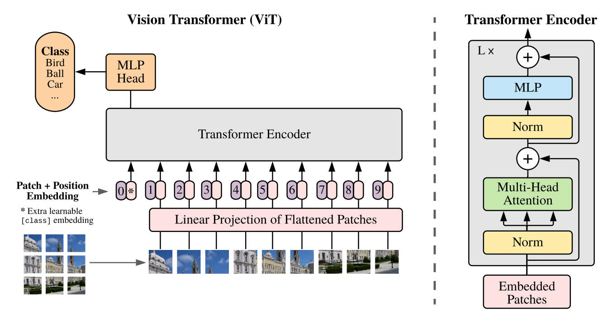

# Flower Image Classification using Vision Transformer
The repository contains the code for the flower image classification using Vision Transformer in the TensorFlow 

- Arxiv Paper: [AN IMAGE IS WORTH 16X16 WORDS:TRANSFORMERS FOR IMAGE RECOGNITION AT SCALE](https://arxiv.org/pdf/2010.11929.pdf)
- Blog Post: [Vision Transformer](https://idiotdeveloper.com/vision-transformer-an-image-is-worth-16x16-words-transformers-for-image-recognition-at-scale/) by Idiot Developer
- YouTube Tutorial: [Vision Transformer Implementation In TensorFlow](https://youtu.be/Fb1xsTXT4P8)

## Architecture
|  |
| :--: |
| *The block diagram of the Vision Transformer along with the Transformer Encoder.* |

## Contact:
For more follow me on:

- <a href="https://www.youtube.com/idiotdeveloper"> YouTube </a>
- <a href="https://facebook.com/idiotdeveloper"> Facebook </a>
- <a href="https://twitter.com/nikhilroxtomar"> Twitter </a>
- <a href="https://www.instagram.com/nikhilroxtomar"> Instagram </a>
- <a href="https://t.me/idiotdeveloper"> Telegram </a>
